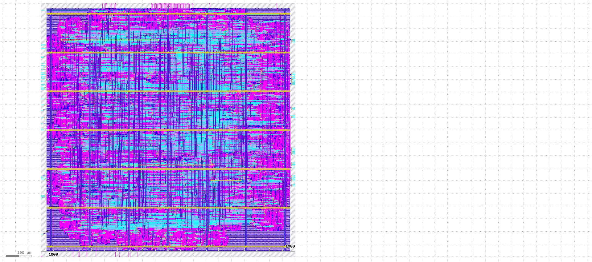
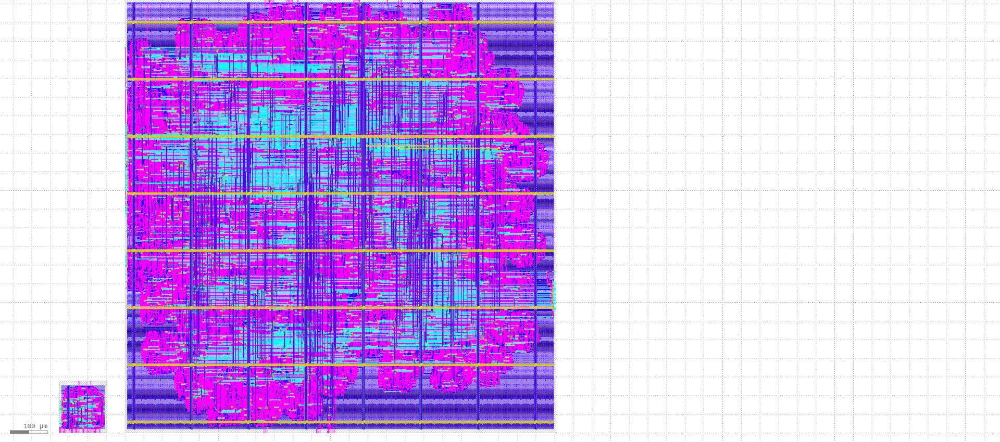
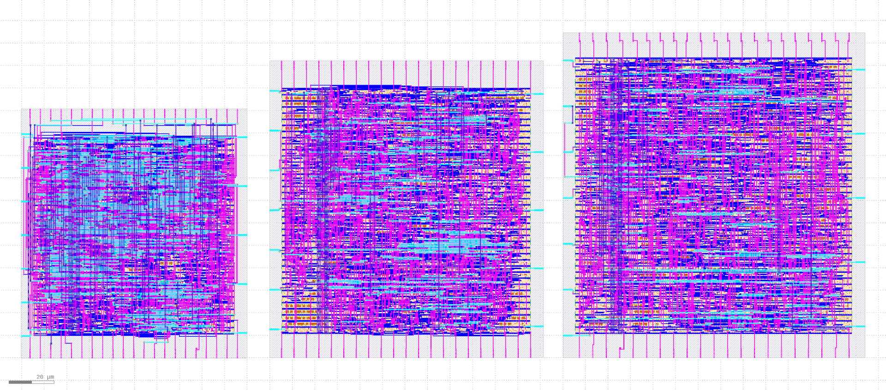

# ECE 755 — Area-Efficient GEMM Core for Edge Inference

An 8×8 systolic GEMM accelerator taped out in **Skywater 130 nm**. FP4 weights and activations, FP16 accumulators, FP16×FP16 → FP4 vector quantization on output. The full chip closes timing at 14 ns (≈137 MHz at typical PVT), delivering **3.59 GFLOPS/s** at **0.40× the power** of a naive flattened baseline. This is a 2.25× throughput improvement at lower power, achieved by hardening the PE and vector-unit as floorplanned macros and adopting a pruned Dadda multiplier in the scale path.

> ECE 755, University of Wisconsin–Madison ·
> **Team:** Ashwin K. Avula · Shao-Kai Chang · Samuel Cooper · Advait Paithankar · Rohan Rao

---

## Final Layout

| Hierarchical (final) | Side-by-side comparison |
| :---: | :---: |
|  |  |

The hardened version places 64 GEMM PE macros in an 8×8 grid above a single 8-lane vector-unit macro. 

## Final PPA — three flows compared

| Metric | Design 1 Flat (baseline) | Design 2 Flat | **Design 2 Hierarchical (signoff)** |
|---|---:|---:|---:|
| f_max (typical corner) | 59.1 MHz | ~86 MHz | **136.7 MHz** |
| Throughput | 1.59 GFLOPS/s | 2.32 GFLOPS/s | **3.59 GFLOPS/s** |
| Power (normalized) | 1.00× | 0.85× | **0.40×** |
| Area (normalized) | 1.00× | 1.00× | 1.60× |
| Worst setup slack @ 14 ns (min_ss) | -19.04 ns ✗ | -8.47 ns ✗ | **+0.61 ns ✓** |
| Cells (incl. macros) | 71,167 | 69,374 | 13,004 + 65 macros |
| Die area | 1.02 mm² | 1.01 mm² | 1.63 mm² |

Reported clock is 14 ns target. Design 1 / Design 2 Flat fail timing at min_ss and nom_tt; only the hierarchical floorplan with hardened PE / vector_unit macros closes all three corners. Per-corner numbers live in [`Synthesis/<flow>/metrics.json`](Synthesis/).

The throughput win is mostly from the hardened PE as the global router stops dictating the critical path and timing becomes predictable. The power win comes similarly, fixed macro placement narrows the parasitic spread across PVT corners.

### Layout Optimizations — PE Routing Density Sweep



---

## Top-Level Specification

| Parameter | Value |
|---|---|
| Systolic array | 8×8 output-stationary MAC PEs (64 total) |
| Vector unit | 1×8 lanes, hardware FP4 quantization + ReLU |
| Activation / weight format | FP4 E2M1 (1 sign, 2 exp, 1 mant) |
| Accumulation format | FP16 IEEE 754 half precision |
| Output format | FP4 E2M1 (quantized) |
| Max tile size | A=8, W=8, K=8 (an 8×8×8 tile) |
| Supported tile sizes | Any rectangular tile with A, W, K each in [1, 8] |
| FIFO depth | 8 entries per array row and column |
| Target clock | 14 ns (71.4 MHz constraint) |
| Process / library | SkyWater SKY130 (sky130A, sky130_fd_sc_hd) |

A tile computes `Y[A×W] = Activation[A×K] × Weight[K×W]`. Tile dimensions arrive as 4-bit metadata (`A_LEN`, `W_LEN`, `K_LEN`); the control unit derives `A_MASK` / `W_MASK` row/column masks that gate the enable vectors, so a sub-maximal tile activates a sub-rectangle of PEs and FIFOs with no reconfiguration. `K > 8` is handled by the host as a sequence of tiles — `BIAS_NEW` selects whether a tile starts a fresh accumulation or continues onto the in-place PE accumulators, and `TILE_LAST` marks the tile whose result flushes through the vector unit.

---

## Interface and Handshake Protocol

All external channels use independent **ready/valid handshakes** — a data beat transfers on a rising clock edge only when both `*_VLD` and `*_RDY` are asserted. The channels handshake independently of one another, so the host can stream metadata, data, and bias on their own schedules.

| Channel | Valid / Ready | Dir | Payload |
|---|---|---|---|
| Metadata | `METADATA_VLD` / `METADATA_RDY` | In | `TILE_START`, `TILE_LAST`, `BIAS_NEW`, `RELU_EN`, `A_LEN`, `W_LEN`, `K_LEN` |
| Data | `DATA_VLD` / `DATA_RDY` | In | `A_DATA[8][4]` activations, `W_DATA[8][4]` weights |
| Bias | `BIAS_VLD` / `BIAS_RDY` | In | `BIAS[16]` (FP16) |
| Scale | `SCALE_VLD` / `SCALE_RDY` | In | `SCALE[16]` (FP16) |
| Output | `Y_VLD[8]` / `Y_RDY` | Out | `Y_OUT[8][4]` quantized FP4 results |
| Status | `TILE_DONE` (pulse) | Out | Single-cycle tile-completion strobe |

Per-channel `*_RDY` doubles as natural backpressure: **Metadata** is accepted only in `IDLE`; **Data** stays ready until the `K`-th data beat; **Bias** is only ready when `BIAS_NEW` is set; **Scale** follows `Y_RDY` so scale beats arrive in lockstep with output beats; **Output** asserts `Y_VLD[8]` per lane through a 2-cycle vector-unit pipeline. `TILE_DONE` is a status strobe, not a handshake.

---

## Architecture

### System-level

<table>
<tr>
<td width="28%" align="center"></td>
<td width="72%" align="center"></td>
</tr>
</table>

The GEMM core works by a host CPU staging activation and weight tiles into the on-chip FIFOs via ready/valid handshakes, signals `TILE_START`, the systolic array streams the result, and the vector unit applies an FP16 scale before producing FP4 outputs. Tiling and dataflow scheduling for matrices larger than 8×8 are done through the host CPU. 

### GEMM top

Inside `gemm_top.sv`:
- **`gemm_control_unit`** — handshake FSM that drives per-row and per-column enables, bias loading, and the read out column mux.
- **`gemm_fifo_array` ×2** — one for activations (per-row) and one for weights (per-column). Each is 8 instances of `gemm_fifo.sv`.
- **`gemm_systolic_array`** — 8×8 mesh of `gemm_pe.sv` instances. Activations flow east, weights flow south, enables ripple diagonally so `PE[i][j]` activates at cycle `i+j`.
- **`vector_unit`** — 8 lanes of `FloatP16x4`, sharing a single `SCALE` value broadcast across the row.

### Control flow

Control is **centralized, not a global pipeline** — `gemm_fsm` plus its datapath wrapper `gemm_control_unit` sequence the entire core through three discrete phases per tile (load, compute, flush), running to completion in order. Within a tile the systolic array is pipelined as data ripples through the mesh, but tile-level scheduling is sequential.

| State | Action | Cycles in state |
|---|---|---|
| `IDLE` | Wait for `TILE_START && METADATA_VLD`. Latch metadata, derive masks. | 1 (handshake) |
| `LOAD_FIFO` | Write activation/weight FIFOs (`K` beats) and optionally load `W` bias values in parallel. | `max(K, W)` |
| `GEMM_COMPUTE` | Stream FIFOs into the array. `pe_wave` shift register supplies a `K`-wide diagonal enable window so each PE is active for exactly `K` cycles. | `A + W + K − 1` |
| `GEMM_FLUSH` | Read array out column-by-column through the vector unit (scale → FP4 quantize → optional ReLU). | `W` (+ 2-cycle vector drain) |

After `GEMM_COMPUTE`, if `TILE_LAST` is unset the FSM returns to `IDLE` and partial sums stay in the PE accumulators for the next tile; if it is set, it transitions to `GEMM_FLUSH`. `TILE_DONE` pulses on every tile boundary. A full 8×8×8 tile takes ~40 cycles end-to-end (8 load + 23 compute + 8 flush + handshake / pipeline drain).

### Processing element

| Original (1-stage) | Pipelined (2-stage, used in final) |
| :---: | :---: |
|  |  |

Each PE is a fully-pipelined MAC:

1. **Stage 1** — `a_in` and `w_in` are AND-gated by `pe_en = h_en_in & v_en_in` (zeroes the multiplier when the PE is inactive, suppressing switching power), then fed to a `FloatP4x16` FP4×FP4 → FP16 multiplier. The product is registered in `mul_out_q`.
2. **Stage 2** — `mul_out_q` adds to `acc_q` via `fp16_adder_truncation`, gated by `pe_en_q` (the 1-cycle-delayed enable that aligns with the registered product).

Bias is loaded directly into the accumulator on `ld_bias` (mutually exclusive with compute). The PE has **no reset** as the FSM guarantees a `LD_BIAS` fires before any compute, which initializes the accumulator deterministically.


### Floating-point datapaths

Three FP units were hand-optimised for the design. Each one was the bottleneck in an earlier iteration; each one has measured before/after numbers from synthesis.

**FP16 dual-path adder** (`fp16_adder_truncation.sv`). The original adder had a long sequential path: bidirectional barrel shifter → 11-bit ripple-carry mantissa adder → full rounding stage with an extra exponent shifter. The optimised design splits this into a **near path** (effective subtractions with `|exp_diff| ≤ 1`: large shift *after* the add, leading-one-detector tree for normalize, 14-bit Kogge-Stone subtractor) and a **far path** (additions and large-difference subtractions: large shift *before* the add, 15-bit Kogge-Stone add/sub, 1-bit normalize). Rounding is replaced with round-toward-zero truncation. Net: **69.6 MHz → 89.1 MHz**, nominal power **0.172 mW → 0.124 mW**, mantissa error contribution ~0.02%.

| Original FP16 adder | Dual-path FP16 adder |
| :---: | :---: |
|  |  |

**Pruned Dadda multiplier** (`dadda_mul_trunc.sv`). The vector unit's 11×11 mantissa multiply only needs the top 8 product bits, so the design builds **only the partial products and reduction cells that feed bits [21:14]** — 45 reduction cells (3 HAs + 42 FAs) vs. 90 in the full tree, followed by an 8-cell ripple-carry adder that resolves only the top 8 bits. Net: **7,172 µm² → 2,320 µm²**, nominal power **0.378 mW → 0.031 mW**, frequency **110.4 MHz → 144.3 MHz**, with ~0.15–0.21% lost carries.

| Original Dadda multiplier | Pruned Dadda (used in vector unit) |
| :---: | :---: |
|  |  |

**FP4×FP4 → FP16 multiplier** (`FloatP4x16.v`). The 2-bit effective-mantissa multiply is handled by `FixedP2x4_opt`, a hand-built 2×2 unsigned multiplier built directly from its truth table with only AND and XOR gates and explicit zero-input skipping. Small block, but it gets replicated 64× (one per PE), so the area win compounds.

**PE pipelining.** The original single-cycle PE had gate depth 60 (~73 MHz). Inserting a register between the FP4 multiply and the FP16 add split it into the 2-stage pipeline used today, lifting cell-level fmax to **~91 MHz**.

### Control & data flow

| Control unit / FSM | Systolic data flow | Systolic control |
| :---: | :---: | :---: |
|  |  |  |

| FSM (top) | FIFOs | Vector unit |
| :---: | :---: | :---: |
|  |  |  |

---

## Detailed Synthesis Results

Hierarchical APR, signed off across `nom_tt_025C_1v80`, `min_ss_100C_1v60`, and `max_ff_n40C_1v95` at a 14 ns target.

### Final `gemm_top` (hierarchical)

| Metric | Value |
|---|---|
| Die area | 1.632 mm² (1240 × 1316 µm) |
| Core area | 1.579 mm² |
| Total cell area | 1.034 mm² (macros 0.971 mm², std cells 0.063 mm²) |
| Instances | 13,004 (65 macros: 64 PE + 1 vector unit; 12,939 std cells) |
| Core utilization | 65.5% |
| Routed wirelength | ≈ 1.14 m |
| Setup slack, worst (nom corner) | +6.68 ns |
| Hold slack, worst (nom corner) | +0.31 ns |
| Setup / hold violations | 0 across all three corners |
| Nominal max frequency | 136.7 MHz (14 ns target − 6.68 ns slack) |

### Macros

The **GEMM PE macro** is 14,344 µm² (≈ 0.014 mm²) with 1,410 std cells at 86.4% utilization, +6.73 ns setup slack at the nom corner (~137.5 MHz). It is consistently the hierarchical critical path; the flat APR critical path is routing-dominated and varies by corner. The **vector unit macro** is hardened as a single 1149 × 46 µm row (≈ 0.053 mm²), matched to the width of the systolic array so it places directly beneath it.

Timing closed cleanly at all three corners; residual signoff items are limited to a small number of max-slew and antenna warnings at the slow corner. Per-corner numbers are in [`Synthesis/<flow>/metrics.json`](Synthesis/).

---

## Repository layout

```
ECE755_TPU/
├── Design2/src/                     RTL
├── Design1/                         Baseline reference (single-stage PE)
├── Synthesis/                       Hardened tapeout artifacts (read-only)
│   ├── gemm_pe/                     PE macro: GDS, LEF, SDF, Liberty, metrics
│   ├── vector_unit/                 8-lane vector unit macro
│   ├── gemm_top_design1/            Design 1 flat (baseline)
│   ├── gemm_top_design2_flat/       Design 2 flat
│   └── gemm_top_design2_hierarch/   ★ Final hierarchical signoff
├── openlane/                        OpenLane2 replication scripts (older flow)
│   ├── scripts/run_flow.sh          Single-config driver
│   ├── design2_hier/run_hier.sh     Two-step PE → top driver
│   └── design2_*/                   Per-flow config.json + constraints
├── DesignDiagrams/                  Architecture PNGs (referenced above)
├── Verification/                    Top-level testbenches (including MNIST)
└── Gemm_Top_Results.xlsx            PPA spreadsheet across runs
```

`Synthesis/` holds the final correct outputs and configs from the signoff flow (14 ns clock, hardened macros). `openlane/` is older and parameterized for a 20 ns target.

---

